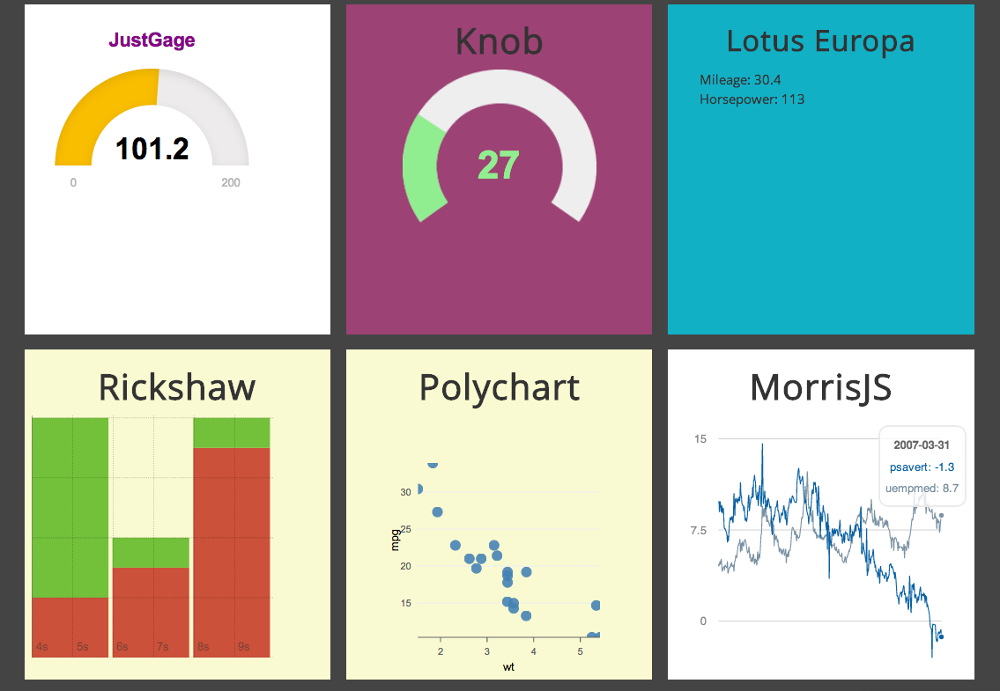

## Dashifyr

A dashboarding framework based on Shiny. 

Note. Highly Experimental!

### Installation

You can install `dashifyr` from github. It requires `shinyGridster` as a dependency.

```coffee
require(devtools)
install_github('shinyGridster', 'wch')
install_github('dashifyr', 'ramnathv')
```

### Demo

Dashifyr comes with a demo app, which can be run using the following commands.

```coffee
require(dashifyr)
demoapp = system.file('demo', package = 'dashifyr')
shiny::runApp(demoapp)
```

